# ArCoach

ArCoach is an AI-powered fitness coaching app for Android that turns your smartphone into a personal trainer. It uses the device camera and on-device ML to analyze exercise form in real time, count repetitions, and deliver voice feedback - no internet required for workouts.

## Features

### Real-Time Pose Analysis
- Detects 33 body landmarks per frame using **ML Kit Pose Detection**
- Computes joint angles with exponential smoothing for stable readings
- Classifies form quality: **Green** (perfect) / **Yellow** (needs improvement) / **Red** (incorrect)
- Draws a live skeleton overlay on the camera feed

### Voice & Haptic Feedback
- Announces rep count and motivational phrases every 5 reps via **TextToSpeech**
- Speaks form correction tips when bad form is detected (5-second cooldown to avoid spam)
- All voice messages are **localized** (English, Russian, Armenian) and use the system language
- Optional vibration on each completed rep

### Camera
- Supports switching between **front and rear camera** during a workout
- **Sensor landscape** orientation - works in both landscape directions (0° and 180°)
- Skeleton overlay stays correctly aligned when flipping camera or rotating the device

### Supported Exercises
| Exercise | What is tracked                                     |
|---|-----------------------------------------------------|
| Squats | Knee angle - depth, too deep detection              |
| Push-ups | Elbow angle - range of motion                       |
| Jumping Jacks | Arm raise + leg spread relative to body proportions |
| Plank | Body alignment angle - hip sag / pike detection     |

### Statistics
- Workout history stored locally in **Room** database
- Charts powered by **MPAndroidChart**:
    - Reps over the last 7 days
    - Accuracy trend over time
    - Exercise distribution (pie chart)
    - Per-exercise best and average stats

### Achievements
- 13 unlockable achievements based on total reps, workout count, and training streaks
- Displayed with unlock status in a dedicated screen

### Profile & Progress
- Customizable name and avatar
- Personal rank system (Beginner -> Intermediate -> Advanced -> Expert)
- Personal info: age, height, weight, BMI calculation
- Training streak tracker

### Account & Cloud Sync
- **Firebase Authentication** - email/password sign-in with email verification, Google sign-in
- **Firestore** cloud backup and restore for workouts and profile
- Auto-sync on login (if local data is empty) and on exit (if auto-sync is enabled)
- Manual sync with conflict resolution dialog
- Works fully offline - cloud sync is optional

### Settings
- Toggle voice prompts and adjust volume
- Toggle vibration
- Daily workout reminders (local notifications)
- Clear all local data
- Export / import local backup (JSON)

## Tech Stack

| Layer | Technology |
|---|---|
| Language | Java |
| Min SDK | 27 (Android 8.1) |
| Target SDK | 35 |
| Pose Detection | ML Kit `pose-detection-accurate` 18.0.0-beta5 |
| Camera | CameraX 1.5.2 |
| Local DB | Room 2.8.4 |
| Charts | MPAndroidChart v3.1.0 |
| Cloud | Firebase BoM 34.7.0 (Auth + Firestore + Analytics) |
| JSON | Gson 2.13.2 |

## Localization

The app is available in **English**, **Russian**, and **Armenian**. All user-visible strings - including voice prompts - adapt to the system language.

---

Train smarter. Get better. Stay motivated with ArCoach.

## Screenshots
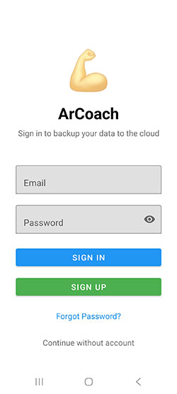
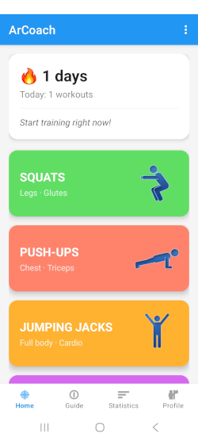
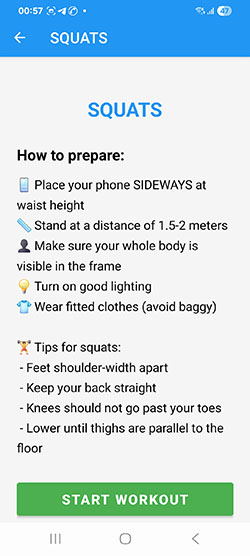
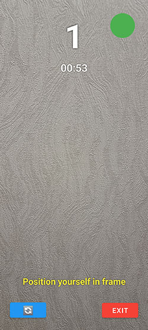
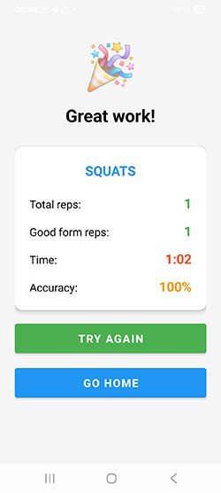
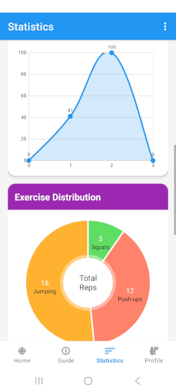
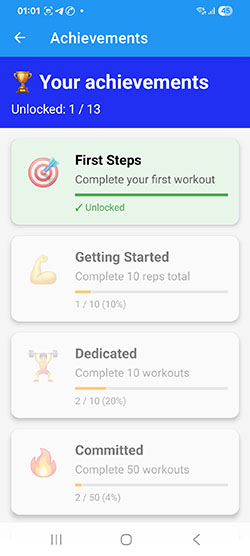
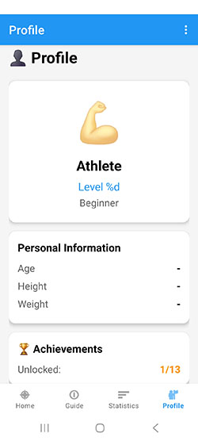
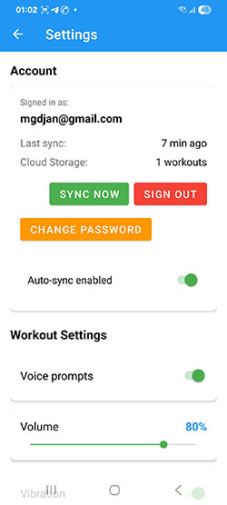
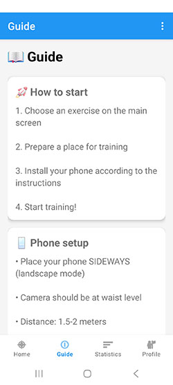
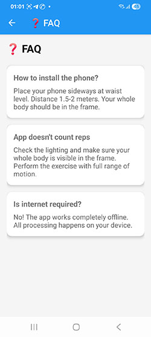
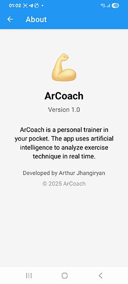
